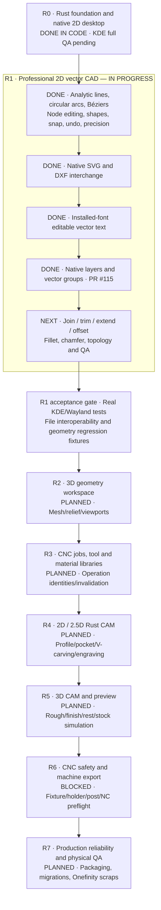

# CarveFoundry — full Rust roadmap progress diagram

**Snapshot:** 2026-10-09 (UTC); PR #115 merged to `main` as
`1034c32628bcc12b0e2322f209d9b1ccf366db08`.
[Rust CI #38010068138](https://github.com/newnetmp3/CarveFoundry/actions/runs/38010068138)
passed **69 core tests, 17 studio tests, strict Clippy and native Linux release**.

## Progress interpretation

**R0:** Rust monorepo and functional design desktop shipped and CI-verified;
some real KDE Plasma/Wayland acceptance still remains.

**R1:** Substantial CAD features shipped through [PR #115](https://github.com/newnetmp3/CarveFoundry/pull/115):
retained analytic paths and direct editing, drag correction confirmed by the
owner, precision snapping/transforms, SVG and DXF exchange, native vector
text, now first-class layers and groups. **R1 is not complete** until source-
accurate trim/join/extend/offset, corner operations and focused desktop QA.

**R2–R5:** Mesh and actual native CAM/stock simulation are upcoming;
no claim of toolpath parity or machine readiness is made.

**R6:** Independent *safety gate*: enforce stock/workholding/holder/tool
and machine-travel limits, tool-specific output with mandatory probing,
and validation of the *posted* NC before unlocking any G-code output.

**R7:** Production packaging, recovery, migrations, golden projects,
independent validation and actual machine scrap-cut acceptance.

This visual is intentionally **status-based, not a percentage guess**:
the eight phases differ greatly in scope and are not equally weighted.
Only R0 and the listed R1 slices have code and CI verification. Real desktop
and physical cutting are separate acceptance criteria.
