# CarveFoundry — full Rust roadmap and verified progress

**Snapshot:** 2026-10-10. Latest verified code merge:
[Bézier crossing repair PR #118](https://github.com/newnetmp3/CarveFoundry/pull/118),
`c3f1afc3a7d794b534583b76078edba3bf1a3dee`.
Exact tested head `dccd3d38b7a6022ac2f8cf315ceafb030e4b654c`
passed [Rust CI #38013659809](https://github.com/newnetmp3/CarveFoundry/actions/runs/38013659809):
**94 core + 17 studio = 111 tests**, strict Clippy and Linux native
release compilation.

```mermaid
flowchart TD
    R0["R0 · Native Rust foundation<br/>IMPLEMENTED · KDE manual acceptance partial"]
    subgraph R1["R1 · PROFESSIONAL 2D VECTOR CAD — IN PROGRESS"]
        direction TB
        A["DONE · Exact source line/arc/Bézier editing<br/>Shapes, snapping, node drag, Undo, transforms"]
        B["DONE · Native SVG and DXF interchange"]
        C["DONE · Installed-font text → retained editable outlines"]
        D["DONE · Named layers + flat vector groups · PR #115"]
        E["DONE · Source-exact numeric split/trim/join,<br/>straight offsets and open corners · PR #116"]
        F["DONE · Real line/arc crossings + markers,<br/>closed line corners and circular offsets · PR #117"]
        F2["DONE · Cubic–line/arc/cubic crossing fix · PR #118<br/>Tangent roots and original-source validation"]
        G["NEXT R1h · Advanced curved offsets,<br/>targeted extend, complex junctions,<br/>complete KDE and file-interchange QA"]
        A --> B --> C --> D --> E --> F --> F2 --> G
    end
    QA["R1 desktop acceptance gate<br/>KDE/Wayland pointer UX · SVG/DXF roundtrip · golden geometry"]
    R2["R2 · Native 3D geometry workspace<br/>PLANNED · meshes/reliefs/viewport"]
    R3["R3 · CNC jobs + tools/material libraries<br/>PLANNED · operation dependencies/fixture data"]
    R4["R4 · Rust 2D / 2.5D CAM<br/>PLANNED · profile, pocket, V-carving, engraving"]
    R5["R5 · Rust 3D CAM + simulation<br/>PLANNED · rough, finish, rest, stock removal"]
    R6["R6 · MACHINE SAFETY + POSTPROCESSORS<br/>LOCKED · workholding/holder/Z clearance/posted NC validation"]
    R7["R7 · Production QA, recovery, packaging<br/>PLANNED · supervised physical Onefinity trials"]
    R0 --> A
    G --> QA --> R2 --> R3 --> R4 --> R5 --> R6 --> R7
```

## What these statuses mean

| Phase | Verified software so far | Outstanding acceptance |
|---|---|---|
| R0 | Rust CAD foundation, desktop and project/Undo tests | Comprehensive real KDE/Wayland user testing |
| **R1** | Most baseline 2D CAD, interop, text, groups/layers, exact split/trim/join, line/true-circle intersections and corners | Robust mixed/cubic offsets, targeted extend, advanced multi-curve corners, full KDE UX and independent SVG/DXF fixtures |
| R2 | Not implemented in pure Rust reboot | 3D mesh/relief workspace and viewport |
| R3 | Not implemented | CNC job, tool/material catalogs, dependency invalidation |
| R4 | Not implemented | 2D/2.5D machining and safe operation geometry |
| R5 | Not implemented | 3D machining and trustworthy stock simulation |
| R6 | Intentionally **blocked** | Holder/fixture/stock/machine-travel/postprocessed NC preflight and independent safety review |
| R7 | Not implemented | Packaging, recovery, migrations, goldens and real machine scrap testing |

**No invented overall percentage.** R0 and code-delivered portions of R1
have CI verification, not blanket real-desktop certification. R2–R7 differ
vastly in scope from R1 and are not equally weighted. Machine NC export
remains disabled until all independent R6 validation gates are ready.

See [INTERSECTION_EDITING.md](INTERSECTION_EDITING.md) for supported
line/arc/Bézier crossing combinations and source-preserving offset limits.
