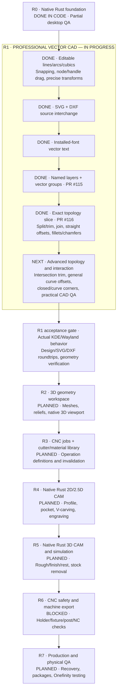

# CarveFoundry — full Rust roadmap progress diagram

**Verified snapshot:** October 9–10, 2026. Native R1f numeric topology
[PR #116](https://github.com/newnetmp3/CarveFoundry/pull/116)
merged into `main` at `5e5747bd6d6f1abd10ffd9d9c5bf9f1233a52a05`.
Its exact head `2c378a3986ac96458f3a2377d1f344cc7923feed`
passed [CI #38011306582](https://github.com/newnetmp3/CarveFoundry/actions/runs/38011306582):
**78 core + 17 studio = 95 tests, strict Clippy, native Linux release**.

### Scope and completeness

| Phase | Software status | Acceptance still required |
|---|---|---|
| **R0** | Rust workspace, project, 2D native UI and CI implemented | Full KDE Plasma/Wayland manual QA |
| **R1** | Core analytic CAD, editor UX, SVG/DXF, fonts, groups/layers and first exact topology tools delivered | Intersection-aware trim/extend, general curve offsets, remaining corner topology, KDE interaction and independent geometry review |
| **R2** | Not started on pure Rust reboot | 3D mesh/relief import, native camera, viewport, transforms |
| **R3** | Not started | Cutter/material sources, typed job operations, dependency invalidation |
| **R4** | Not started | Actual 2D/2.5D machining operations, cutting geometry |
| **R5** | Not started | Rough/finish/rest 3D CAM, stock simulation, deterministic validation |
| **R6** | **Intentionally locked** | Machine, workholding, cutter holder, Z-rapid, postprocessed NC preflight, tool-change probing |
| **R7** | Not started | Atomic recovery, distribution, independent NC verification, supervised physical scrap tests |

This diagram shows *verified feature delivery* rather than invented percentage
completion. Phase durations are unequal: green CAD tests are **not** evidence
of CAM performance, safe machine output or physical Onefinity readiness.

### Immediate next milestone

**R1g** — select a curve intersection visually and trim/explode only
representable source segments, implement robust general curved offsets
without sampling/raster approximations, closed-path corner operations,
and high-priority KDE/Wayland QA. Keep format and undo history stable.

For safe geometric limits and the currently available numeric tools,
see [TOPOLOGY_EDITING.md](TOPOLOGY_EDITING.md).
